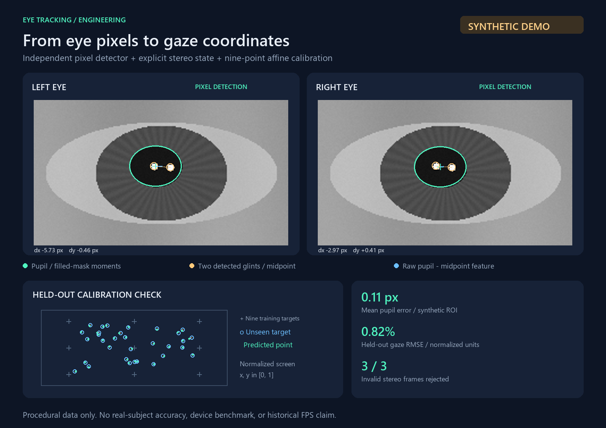

# 眼动特征与双眼处理架构参考

**Pupil–glint features · stereo state isolation · explicit calibration labels**

[](https://github.com/aixiaoxin0410/eye-tracking-reference/actions/workflows/ci.yml)

把眼动处理拆成可检查的三个环节：从眼部 ROI 检测瞳孔与双光斑、生成双眼四维差分特征、通过九点标定映射到归一化屏幕坐标。配套 C++17 参考模块展示长期双 worker、每眼独立状态和按事件采样的标定接口。



图中眼图、标定点和测试样本均由程序生成，标记为 **SYNTHETIC DEMO**。数值来自本仓库独立 Python 验证器的实际运行，不代表真实受试者精度、板端性能或原工程测量结果。

## 可运行范围

| 内容 | 状态 | 边界 |
| --- | --- | --- |
| `demo/eye_demo.py` | 可直接运行 | NumPy/Pillow 合成眼图、像素检测、仿射标定与结果图；无相机和真实眼部数据 |
| `cpp/include/` | 可编译、已验证 | 独立类型、标定采样器、双 worker 模板；检测器由调用方注入 |
| `cpp/tests/test_reference.cpp` | 可运行 | 用带状态的计数检测器检查并发与接口行为，不测视觉算法 |
| `integration/eye_tracking_graph.pbtxt` | Integration sketch | 缺少 Calculator 实现、BUILD 规则、相机和 ROI 上游，不能单独运行 |

这是基于已整理的架构参考材料重新组织的公开示例。原检测器、完整时序滤波器、设备通信与训练实现不包含在仓库中。Python 像素检测器为独立编写的概念验证，不是原 C++ 检测器移植；C++ 基础模块也不宣称还原历史产品代码。

## 快速运行

这是独立仓库，包含自己的代码、演示素材、依赖与 CI，无需下载其他项目。

```bash
git clone https://github.com/aixiaoxin0410/eye-tracking-reference.git
cd eye-tracking-reference
python -m venv .venv
```

Windows 使用 `.venv\Scripts\activate`，Linux/macOS 使用 `source .venv/bin/activate`。之后在仓库根目录执行：

```bash
python -m pip install -r requirements.txt
python demo.py
python -m unittest discover -s tests -v
```

无需 API Key、GPU、预训练权重或外部图片。默认种子为 `27`。

主要输出：

- [`assets/eye_tracking_demo.png`](assets/eye_tracking_demo.png)：双眼检测与标定结果总览。
- [`assets/synthetic_metrics.json`](assets/synthetic_metrics.json)：生成口径、完整训练特征、回归权重、逐帧测试结果和失败处理。
- [`examples/demo_manifest.json`](examples/demo_manifest.json)：数据来源和可重现命令。
- `assets/synthetic_left_roi.png` / `synthetic_right_roi.png`：独立原始输入，可核对叠加结果。

若想改变种子或将临时输出放在别处：

```bash
python demo.py --seed 42 --output /tmp/eye-demo
```

## 结果怎么读

绿色椭圆与十字由暗区域的填孔掩膜计算，橙色圆圈标记检测到的两处亮反光，蓝色线段表示 `pupil - mean(glint1, glint2)`。下方九个灰色十字是训练目标，蓝色空心点为未参与训练的目标，绿色实心点为预测落点。

默认种子的实际运行结果如下，完整浮点值保存在 JSON 中：

| 检查项 | 合成演示结果 |
| --- | --- |
| 标定样本 | 9 个位置 × 每点 10 对双眼，共 90 对 |
| 独立测试样本 | 32 个另外采样的目标位置 |
| 瞳孔中心平均误差 | 0.1054 px，统计训练与测试共 244 张眼图 |
| 独立测试落点 RMSE | 0.008206，归一化坐标；图中以 0.82% 显示 |
| 独立测试落点 P95 距离误差 | 0.013577，归一化坐标 |
| 失败样例 | 左眼眨眼、右眼眨眼、缺失一个光斑，3/3 被判无效 |

RMSE 定义为 `sqrt(mean((pred_x-target_x)^2 + (pred_y-target_y)^2))`，不是角度误差、屏幕像素误差或屏幕对角线百分比。合成器刻意使用近似线性的目标—特征关系，且光照、瞳孔形状简单；较小误差主要验证端到端接口一致性，不能外推真实眼动精度。

检测器只接收像素，生成器的真值只用于事后误差计算。标定和测试使用不同样本；测试目标不参与模型拟合。

## 实现与工程取舍

```text
Procedural eye ROI pair
  ├─ left: threshold → component → pupil / two glints ─┐
  └─ right: threshold → component → pupil / two glints ├─ four raw features
                                                     │
               nine labeled targets → affine fit ───┴─ normalized gaze
```

1. **先隔离状态，再做并行。** 每眼有独立检测器与长期 worker。任务由同一对帧触发，等待双眼完成后返回；不会每帧创建线程，也不会把一个有时序状态的检测器交给两线程共同调用。
2. **线程启动与异常边界明确。** C++ 构造函数完成成员初始化后才启动线程；检测异常被捕获并在调用线程重新抛出，另一个 worker 仍完成任务，之后可继续提交新帧。
3. **标定与在线特征保持一致。** 两阶段都使用原始 `dx, dy`，不混用原始与平滑特征。公开演示没有实现最终时序滤波，避免把平滑效果混入模型精度。
4. **样本显式携带标签。** `CalibrationSession` 保存点编号、目标坐标和双眼时间戳；按 `begin_point → add → end_point` 收集，不通过总帧数平均分段猜测标签。
5. **无效帧不伪造新落点。** 任一眼无效，返回 `valid=false`；只有历史有效预测存在时才 `held=true` 并保留旧坐标。首帧失败时返回空坐标。左右时间戳不一致或不递增会被拒绝。
6. **缩小数据边界。** 视觉阶段接收眼部 ROI，后续接口只传特征。实时接入还需限长队列、过期帧丢弃策略和原始帧时间戳；本模块没有假装实现相机背压系统。

像素检测的固定阈值、最大暗连通域和双亮斑筛选是为了让流程易于复现。眼镜反光、多光斑、复杂光照、眼睑遮挡、头动和用户差异都需要更强的候选评分与真实数据评估。

## 编译 C++ 行为示例

模块只需要 C++17 标准库及线程支持。以下命令从项目目录执行：

```bash
g++ -std=c++17 -Wall -Wextra -pedantic -pthread -I cpp/include cpp/tests/test_reference.cpp -o test_reference
./test_reference
```

Windows MinGW 可将产物命名为 `test_reference.exe` 后执行。也提供 CMake：

```bash
cmake -S cpp -B build
cmake --build build --config Release
ctest --test-dir build -C Release --output-on-failure
```

本地已使用 MinGW g++ 完成编译与运行，GitHub Actions 的 Ubuntu 环境也已通过 CMake 构建与 CTest。行为测试验证独立状态、线程复用、异常后恢复、重复/错配时间戳拒绝及标定标签。此 C++ 示例不依赖 OpenCV 或 MediaPipe，也不包含瞳孔检测实现。

生产级线程安全还需在目标平台运行 ThreadSanitizer 或等价工具；这里未给出此类验证结果。

## 接入真实处理链

参见 [`integration/README.md`](integration/README.md)。需要由使用方提供检测器、Camera/FaceLandmark/EyeRoi 节点、模型持久化、滤波与设备通信；使用 MediaPipe 的两个独立 Calculator 时，直接让 executor 调度双眼，通常不必再嵌套本仓库的双 worker。

没有发布历史 FPS 或提速倍数。接入后应先固定数据集与输入分辨率，再分别计时解码、单眼检测、双眼汇合、预测/滤波和输出，并同时检查检测成功率及落点误差，才能讨论优化效果。
